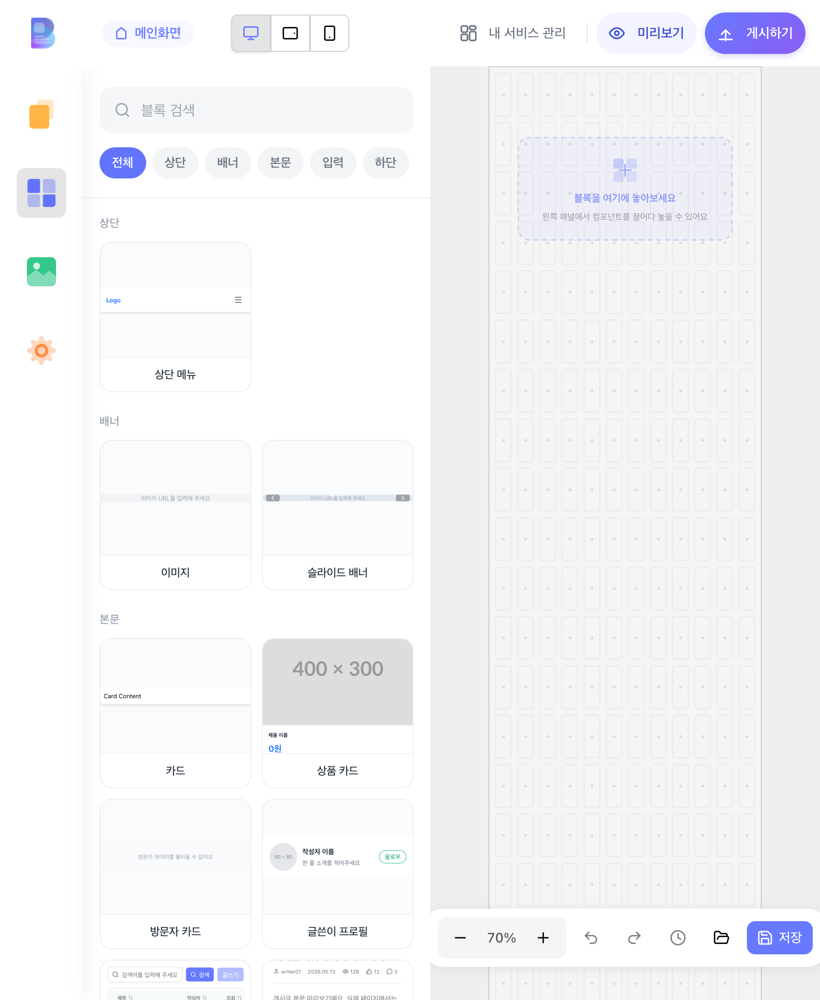
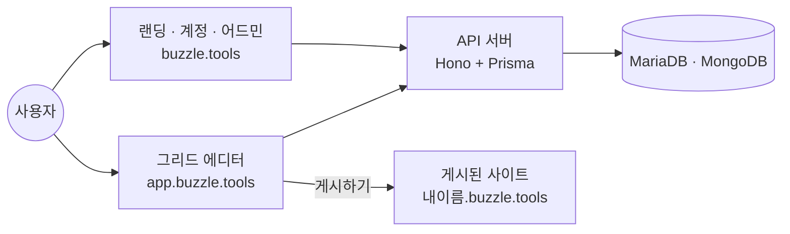

# 버즐 Buzzle

### 코딩 없이, 드래그앤드롭으로 홈페이지를 만듭니다

한국어 노코드 웹사이트 빌더 · HTML을 몰라도 5분이면 첫 화면이 열립니다

 

 

  

 

## 버즐은 무엇인가요

버즐은 **HTML·CSS·JavaScript 지식 없이 웹사이트를 만들고 그 자리에서 발행**하는 노코드 웹빌더입니다.
왼쪽 목록에서 블록을 골라 12열 그리드 캔버스에 끌어다 놓고, 글과 색을 고치고, 버튼 하나로 인터넷에 띄웁니다.

소상공인, 프리랜서, 스타트업처럼 **웹사이트는 필요하지만 개발자는 없는 사람들**을 위해 만들고 있습니다.
인터페이스도 안내도 전부 한국어입니다.

 

## 이런 걸 할 수 있어요

| | |
|---|---|
| 🧩 **블록을 끌어다 놓기** | 이미지·텍스트·버튼·슬라이드 배너·카드·표·폼·게시판을 12열 그리드 위에 배치합니다 |
| 🎨 **눈으로 보며 고치기** | 글자 크기, 정렬, 색, 여백을 속성 패널에서 바로 바꾸고 결과를 즉시 확인합니다 |
| 📱 **모바일까지 한 번에** | 데스크톱과 모바일 화면을 나란히 다루며 반응형으로 맞춥니다 |
| 🚀 **버튼 하나로 발행** | `내이름.buzzle.tools` 주소로 그 자리에서 인터넷에 공개합니다 |
| 💬 **게시판·문의·회원** | 게시판, 문의 폼, 로그인·회원가입 화면을 블록으로 붙입니다 |
| 📦 **웹을 넘어서** | 같은 화면을 웹사이트뿐 아니라 모바일 앱·컴퓨터 프로그램으로도 완성합니다 |

 

## 무엇을 만들 수 있나요

| 회사 소개 | 포트폴리오 | 커뮤니티 | 이벤트·랜딩 |
|:---:|:---:|:---:|:---:|
| 브랜드와 연락처를 담은 소개 사이트 | 작업물을 보여주는 갤러리 | 글과 댓글이 오가는 게시판 | 신청 폼이 달린 한 장짜리 페이지 |

 

## 요금제

| 플랜 | 가격 | 상태 |
|---|---|---|
| **Starter** | 0원 / 월 | ✅ 지금 시작할 수 있어요 — 신용카드가 필요 없습니다 |
| **Pro** | — | 🔜 준비 중 |
| **Business** | — | 🔜 준비 중 |

자세한 비교는 [요금제 안내](https://buzzle.tools/price)에 있습니다.

 

## 아직 지원하지 않는 것

솔직하게 적어 둡니다. 아래는 **현재** 되지 않습니다.

- React·Vue 같은 코드 기반 프레임워크를 직접 편집하기
- 한국어 이외의 인터페이스 언어
- 구글·카카오·네이버 소셜 계정 로그인 (아이디·비밀번호, 패스키, 2단계 인증은 지원합니다)

 

## 어떻게 만들어졌나요

| 영역 | 기술 |
|---|---|
| **에디터** |     · react-dnd, Zustand, TanStack Query, Tiptap |
| **랜딩 · 어드민** |    · Motion, WebAuthn(패스키), Sentry |
| **API 서버** |     · OpenAPI, Zod, 2단계 인증 |
| **디자인 시스템** | [`bds`](https://github.com/teamBuzzle/bds) — 버즐 공통 컴포넌트 |

 

## 팀

버즐은 **teamBuzzle**이 만들고 운영합니다. 제품 코드 저장소는 비공개이며,
공개된 것은 디자인 시스템 [`bds`](https://github.com/teamBuzzle/bds)와 이 소개 문서입니다.

 

### 지금 만들어 보세요

[**무료로 시작하기 →**](https://app.buzzle.tools)

[홈페이지](https://buzzle.tools) · [요금제](https://buzzle.tools/price) · [고객센터](https://buzzle.tools/customer) · [개인정보처리방침](https://buzzle.tools/privacy) · [이용약관](https://buzzle.tools/terms)

© teamBuzzle

